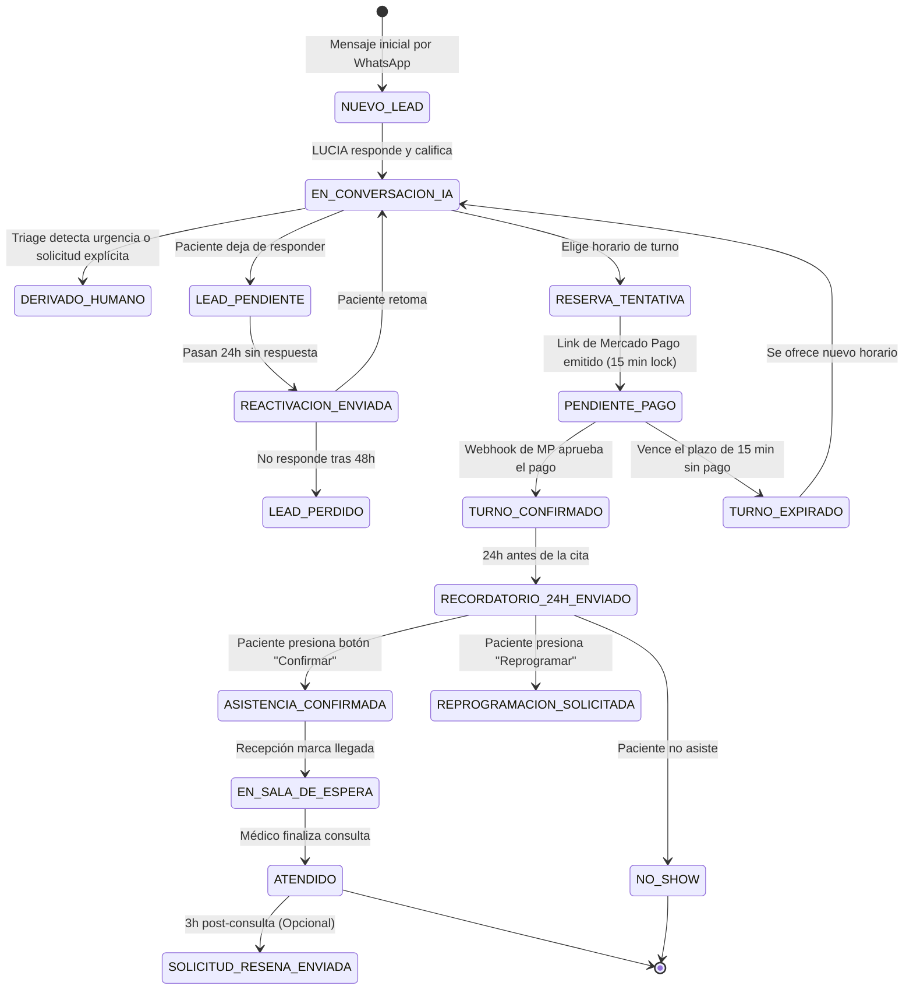

# LUCIA — Tu Recepcionista Oftalmológica Virtual con IA
## 02. Especificación Técnica de Arquitectura y Stack Tecnológico

---

### 1. Diagrama de Arquitectura de Alto Nivel

```mermaid
flowchart TD
    subgraph Paciente & Canales
        WAP[Paciente vía WhatsApp]
        ADS[Meta Ads / Google Ads Inbound]
    end

    subgraph Meta Infrastructure
        WABA[Meta WhatsApp Cloud API]
    end

    subgraph Plataforma LUCIA [Backend & Engine]
        WH[Webhook Inbound Service]
        QUEUE[Redis + BullMQ Job Queue]
        SCHEDULER[Workers: Recordatorios 24h / Reactivación]
        AGENT[Orquestador Agente IA - LLM Engine]
        CALENDAR[Motor de Agenda & Disponibilidad]
        PAYMENTS[Módulo Pagos Mercado Pago]
        ARCA_SVC[Módulo Fiscal ARCA / WSFEv1]
        API[API Core REST / GraphQL]
    end

    subgraph Base de Datos y Cache
        PG[(PostgreSQL - Persistencia Core)]
        REDIS[(Redis - State, Sessions, Locks, Queues)]
    end

    subgraph Clientes Web (CRM LUCIA)
        CRM_SEC[Panel Secretaría / Recepción]
        CRM_MED[Vista Médico Oftalmólogo]
        CRM_MKT[Dashboard Marketing & Analytics]
        CRM_ADM[Configuración & Facturación]
    end

    subgraph Servicios Externos
        MP_API[Mercado Pago API]
        ARCA_API[Servidores ARCA / AFIP - WSAA & WSFE]
        LLM_PROVIDER[OpenAI / Anthropic / Gemini API]
    end

    %% Flujos
    WAP -->|Mensaje| WABA
    ADS -->|Click-to-WhatsApp| WABA
    WABA -->|Webhook Event| WH
    WH -->|Encola Mensaje| QUEUE
    QUEUE --> AGENT
    AGENT <-->|Contexto & Memoria| REDIS
    AGENT <-->|Tool Calling: Turnos| CALENDAR
    AGENT <-->|Tool Calling: Cobros| PAYMENTS
    AGENT <-->|Prompts & Razonamiento| LLM_PROVIDER
    AGENT -->|Respuesta Saliente| WABA

    PAYMENTS <--> MP_API
    PAYMENTS -->|Evento de Pago Aprobado| ARCA_SVC
    ARCA_SVC <--> ARCA_API

    SCHEDULER -->|Recordatorio 24h Pre-Turno| QUEUE
    SCHEDULER -->|Reactivación 24h Lead Frío| QUEUE

    CALENDAR <--> PG
    PAYMENTS <--> PG
    ARCA_SVC <--> PG
    API <--> PG

    CRM_SEC <--> API
    CRM_MED <--> API
    CRM_MKT <--> API
    CRM_ADM <--> API
```

---

### 2. Stack Tecnológico Seleccionado

| Capa / Módulo | Tecnología Seleccionada | Justificación Técnica |
| :--- | :--- | :--- |
| **Frontend CRM** | **Next.js 14+ (App Router, React, TailwindCSS, shadcn/ui)** | Renderizado híbrido rápido, componentes UI accesibles y modernos, SSR para reportes y panel interactivo con WebSockets/Server-Sent Events (SSE). |
| **Backend & Webhooks** | **Node.js (TypeScript) + Fastify / Next.js API Routes** | Rendimiento I/O ultrarrápido para procesar webhooks masivos de WhatsApp y Mercado Pago sin bloqueo de event loop. |
| **Base de Datos Relacional** | **PostgreSQL (v15+) con Prisma ORM / Drizzle** | Integridad relacional estricta para turnos, pacientes, historias clínicas, pagos y comprobantes fiscales con soporte de transacciones ACID. |
| **Colas de Tareas y Caché** | **Redis + BullMQ** | Imprescindible para: (1) Recordatorios diferidos a 24 horas (`delayed jobs`), (2) Evitar doble-booking con locks distribuidos (`Redlock`), (3) Cache de tickets de acceso ARCA (WSAA). |
| **Motor de IA Conversacional** | **LangChain / Vercel AI SDK + LLM (GPT-4o / Claude 3.5 Sonnet)** | Soporte robusto de **Tool Calling** (Function Calling) estructurado con schemas Pydantic/Zod para interactuar con la agenda y el cobro. |
| **Integración WhatsApp** | **Meta WhatsApp Cloud API (Oficial)** | Menor costo por conversación, cumplimiento estricto de políticas de Meta, cero riesgo de baneo de chip compared con soluciones no oficiales. |
| **Pasarela de Cobro** | **Mercado Pago SDK (`mercadopago` v2)** | Checkout Pro (links de pago directos con vencimiento configurable de 15 min), soporte de tarjetas y dinero en cuenta, webhooks seguros. |
| **Facturación Fiscal** | **ARCA (ex-AFIP) WSFEv1 (`afip.js` o cliente SOAP propio con firmado PKCS#7)** | Facturas B y C, obtención automática de CAE, QR fiscal reglamentario y generación de PDF. |

---

### 3. Máquinas de Estado Clave (State Machines)

#### 3.1. Ciclo de Vida del Paciente / Lead en el Pipeline CRM


---

### 4. Seguridad, Roles y Protección de Datos

1. **Gestión de Sesiones y Autenticación**:
   - Autenticación con JWT / Supabase Auth o NextAuth.js.
   - Roles verificados en middleware: `ADMIN`, `SECRETARIA`, `MEDICO`, `MARKETING`.

2. **Aislamiento de Información Médica (PHI - Protected Health Information)**:
   - Los datos clínicos (motivo de consulta, prescripciones, antecedentes) sólo son accesibles para el rol `MEDICO` y `ADMIN`.
   - El rol `MARKETING` tiene visibilidad anónima y agregada (métricas de conversión, campañas, ingresos globales, sin acceso a nombres o diagnósticos).

3. **Caché y Seguridad en Facturación ARCA**:
   - Los certificados digitales `.key` y `.crt` se guardan encriptados en variables de entorno / Vault.
   - El Ticket de Acceso (TA) de ARCA se almacena en Redis con un Time-To-Live (TTL) de 11 horas y 50 minutos (válido por 12 horas) para evitar sobrecargar los servidores de WSAA.
