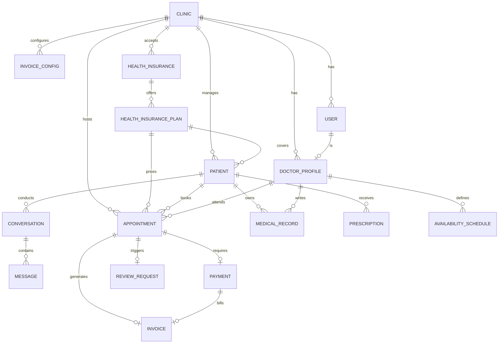

# LUCIA — Tu Recepcionista Oftalmológica Virtual con IA
## 03. Modelo de Datos y Esquema de Base de Datos (PostgreSQL / Prisma)

---

### 1. Diagrama Entidad-Relación (ERD)



---

### 2. Esquema Relacional de Referencia (Prisma Schema)

```prisma
datasource db {
  provider = "postgresql"
  url      = env("DATABASE_URL")
}

generator client {
  provider = "prisma-client-js"
}

// ----------------------------------------------------
// 1. GESTIÓN DE CLÍNICA Y USUARIOS (RBAC)
// ----------------------------------------------------

enum Role {
  ADMIN
  SECRETARIA
  MEDICO
  MARKETING
}

model Clinic {
  id              String           @id @default(uuid())
  name            String
  cuit            String           @unique
  address         String
  phone           String
  whatsappNumberId String?         // ID de número de teléfono en Meta Cloud API
  wabaId          String?          // WhatsApp Business Account ID
  createdAt       DateTime         @default(now())
  updatedAt       DateTime         @updatedAt

  users           User[]
  doctors         DoctorProfile[]
  patients        Patient[]
  appointments    Appointment[]
  invoiceConfig   InvoiceConfig?
}

model User {
  id            String         @id @default(uuid())
  clinicId      String
  clinic        Clinic         @relation(fields: [clinicId], references: [id])
  email         String         @unique
  passwordHash  String
  fullName      String
  role          Role           @default(SECRETARIA)
  isActive      Boolean        @default(true)
  createdAt     DateTime       @default(now())
  updatedAt     DateTime       @updatedAt

  doctorProfile DoctorProfile?
}

model DoctorProfile {
  id                  String                 @id @default(uuid())
  userId              String                 @unique
  user                User                   @relation(fields: [userId], references: [id])
  clinicId            String
  clinic              Clinic                 @relation(fields: [clinicId], references: [id])
  licenseNumber       String                 // Matrícula Nacional / Provincial
  specialty           String                 @default("Oftalmología General")
  appointmentDuration Int                    @default(20) // En minutos
  consultorioNumber   String?
  consultationFee     Decimal                @default(45000) @db.Decimal(10, 2) // Arancel de consulta particular (ARS)
  createdAt           DateTime               @default(now())

  appointments        Appointment[]
  availabilities      AvailabilitySchedule[]
  medicalRecords      MedicalRecord[]
}

model AvailabilitySchedule {
  id          String        @id @default(uuid())
  doctorId    String
  doctor      DoctorProfile @relation(fields: [doctorId], references: [id])
  dayOfWeek   Int           // 0 = Domingo, 1 = Lunes, ..., 6 = Sábado
  startTime   String        // "09:00"
  endTime     String        // "18:00"
  isActive    Boolean       @default(true)
}

// ----------------------------------------------------
// 2. PACIENTES Y CONVERSACIONES (WHATSAPP & CRM)
// ----------------------------------------------------

enum PipelineStage {
  NUEVO_LEAD
  EN_CONVERSACION_IA
  DERIVADO_HUMANO
  LEAD_PENDIENTE_RESPUESTA
  RESERVA_TENTATIVA
  PENDIENTE_PAGO
  TURNO_CONFIRMADO
  RECORDATORIO_24H_ENVIADO
  EN_SALA_DE_ESPERA
  ATENDIDO
  CANCELADO
  NO_SHOW
}

enum ConversationMode {
  AI_AUTONOMOUS
  PAUSED_HUMAN
}

enum ConversationChannel {
  WHATSAPP  // Meta WhatsApp Cloud API
  SIMULATOR // Simulador interno del CRM: nunca envía mensajes a Meta
}

model Patient {
  id                String         @id @default(uuid())
  clinicId          String
  clinic            Clinic         @relation(fields: [clinicId], references: [id])
  phoneNumber       String         // Formato internacional E.164: +54911...
  firstName         String?
  lastName          String?
  dni               String?
  email             String?
  healthInsurance   String?        // Prepaga u Obra Social (ej. OSDE, Swiss Medical, Particular)
  affiliateNumber   String?        // Número de afiliado
  
  // Atribución de Marketing
  utmSource         String?        // ej: "facebook", "google_ads", "organic"
  utmCampaign       String?
  leadScore         Int            @default(0)
  currentStage      PipelineStage  @default(NUEVO_LEAD)

  createdAt         DateTime       @default(now())
  updatedAt         DateTime       @updatedAt

  conversations     Conversation[]
  appointments      Appointment[]
  medicalRecords    MedicalRecord[]
  prescriptions     Prescription[]

  @@unique([clinicId, phoneNumber])
}

model Conversation {
  id              String           @id @default(uuid())
  patientId       String
  patient         Patient          @relation(fields: [patientId], references: [id])
  mode            ConversationMode @default(AI_AUTONOMOUS)
  channel ConversationChannel @default(WHATSAPP)
  pausedUntil     DateTime?
  lastMessageAt   DateTime         @default(now())
  pendingFollowupAt DateTime?      // Programado para regla de 24h sin respuesta
  createdAt       DateTime         @default(now())

  messages        Message[]
}

enum MessageSender {
  PATIENT
  AI_LUCIA
  HUMAN_AGENT
  SYSTEM
}

model Message {
  id              String        @id @default(uuid())
  conversationId  String
  conversation    Conversation  @relation(fields: [conversationId], references: [id])
  sender          MessageSender
  text            String
  metaMessageId   String?       // ID devuelto por Meta Cloud API
  rawPayload      Json?
  createdAt       DateTime      @default(now())
}

// ----------------------------------------------------
// 3. TURNOS, PAGOS (MERCADO PAGO) Y FACTURACIÓN (ARCA)
// ----------------------------------------------------

enum AppointmentStatus {
  TENTATIVE_LOCKED  // Bloqueado temporalmente (15 min) esperando pago
  CONFIRMED
  COMPLETED
  RESCHEDULED
  CANCELLED
  NO_SHOW
}

model Appointment {
  id                String            @id @default(uuid())
  clinicId          String
  clinic            Clinic            @relation(fields: [clinicId], references: [id])
  patientId         String
  patient           Patient           @relation(fields: [patientId], references: [id])
  doctorId          String
  doctor            DoctorProfile     @relation(fields: [doctorId], references: [id])
  
  startDateTime     DateTime
  endDateTime       DateTime
  status            AppointmentStatus @default(TENTATIVE_LOCKED)
  reason            String?           // Motivo triage (ej: "Control de vista", "Fondo de ojo", "Ardor")
  lockedUntil       DateTime?         // Expiración de los 15 minutos de reserva
  reminder24hSent   Boolean           @default(false)
  createdAt         DateTime          @default(now())
  updatedAt         DateTime          @updatedAt

  payment           Payment?
  invoice           Invoice?
  reviewRequest     ReviewRequest?
}

enum PaymentStatus {
  PENDING
  APPROVED
  REJECTED
  REFUNDED
}

model Payment {
  id              String        @id @default(uuid())
  appointmentId   String        @unique
  appointment     Appointment   @relation(fields: [appointmentId], references: [id])
  mpPreferenceId  String?       @unique // ID de Preferencia de Checkout Pro
  mpPaymentId     String?       @unique // ID de transacción real en Mercado Pago
  amount          Decimal       @db.Decimal(10, 2)
  currency        String        @default("ARS")
  status          PaymentStatus @default(PENDING)
  paymentUrl      String?
  paidAt          DateTime?
  createdAt       DateTime      @default(now())

  invoice         Invoice?
}

enum InvoiceType {
  FACTURA_B
  FACTURA_C
  RECIBO_X
}

model InvoiceConfig {
  id              String   @id @default(uuid())
  clinicId        String   @unique
  clinic          Clinic   @relation(fields: [clinicId], references: [id])
  puntoDeVenta    Int      // Ej: 4
  certificatePath String   // Certificado digital de homologación/producción
  privateKeyPath  String   // Llave privada .key
  taxType         String   @default("MONOTRIBUTO") // MONOTRIBUTO (Factura C) o RESPONSABLE_INSCRIPTO (Factura B/A)
  autoInvoiceOnPay Boolean @default(true)
}

model Invoice {
  id              String       @id @default(uuid())
  appointmentId   String       @unique
  appointment     Appointment  @relation(fields: [appointmentId], references: [id])
  paymentId       String?      @unique
  payment         Payment?     @relation(fields: [paymentId], references: [id])
  
  invoiceType     InvoiceType  @default(FACTURA_C)
  puntoDeVenta    Int
  numeroComprobante Int
  cae             String       // Código de Autorización Electrónico ARCA
  caeVencimiento  DateTime     // Fecha de vencimiento del CAE
  qrData          String       // Cadena JSON en Base64 oficial requerida por ARCA
  pdfUrl          String?
  createdAt       DateTime     @default(now())
}

// ----------------------------------------------------
// 4. MÓDULOS OPCIONALES / FASE 2: HISTORIA CLÍNICA & RESEÑAS
// ----------------------------------------------------

model MedicalRecord {
  id              String        @id @default(uuid())
  patientId       String
  patient         Patient       @relation(fields: [patientId], references: [id])
  doctorId        String
  doctor          DoctorProfile @relation(fields: [doctorId], references: [id])
  consultationDate DateTime     @default(now())
  
  // Parámetros Oftalmológicos
  motivoConsulta  String
  antecedentes    String?
  agudezaVisualOD String?       // Ojo Derecho (ej. 20/20)
  agudezaVisualOI String?       // Ojo Izquierdo
  presionOcularOD Decimal?      // PIO Ojo Derecho en mmHg
  presionOcularOI Decimal?      // PIO Ojo Izquierdo en mmHg
  biomicroscopia  String?
  fondoDeOjo      String?
  diagnostico     String
  tratamiento     String?

  createdAt       DateTime      @default(now())
}

model Prescription {
  id              String   @id @default(uuid())
  patientId       String
  patient         Patient  @relation(fields: [patientId], references: [id])
  medicamentos    Json     // Array estructurado: [{ droga, dosis, frecuencia, duracion }]
  indicaciones    String?
  pdfUrl          String?
  createdAt       DateTime @default(now())
}

model ReviewRequest {
  id              String   @id @default(uuid())
  appointmentId   String   @unique
  appointment     Appointment @relation(fields: [appointmentId], references: [id])
  sentAt          DateTime @default(now())
  clicked         Boolean  @default(false)
}
```

---

### 3. Coberturas por Obra Social y Plan (pendiente de implementar — Hito 4)

Implementa las reglas de cobro del PRD §4.4.1. Se agrega al esquema de la sección 2 cuando se implemente.

```prisma
enum CoverageBillingMode {
  SIN_CARGO  // La cobertura incluye la consulta: no se cobra
  COPAGO     // Se cobra un monto fijo al paciente
  SENA       // Se cobra una seña para confirmar el turno
  PARTICULAR // La cobertura no incluye la consulta: se cobra el arancel particular del médico
  NO_ATIENDE // La clínica no atiende esa obra social/plan
}

model HealthInsurance {
  id       String   @id @default(uuid())
  clinicId String
  clinic   Clinic   @relation(fields: [clinicId], references: [id])
  name     String   // Nombre oficial: "OSDE", "Swiss Medical", "PAMI"
  aliases  String[] // Variantes que escribe el paciente: "osde", "o.s.d.e", "swiss"
  isActive Boolean  @default(true)

  plans HealthInsurancePlan[]

  @@unique([clinicId, name])
}

model HealthInsurancePlan {
  id                      String              @id @default(uuid())
  healthInsuranceId       String
  healthInsurance         HealthInsurance     @relation(fields: [healthInsuranceId], references: [id])
  name                    String              // "210", "310"… o "*" = todos los planes sin fila propia
  billingMode             CoverageBillingMode
  amount                  Decimal?            @db.Decimal(10, 2) // Monto del copago o la seña (null en el resto)
  requiresAuthorization   Boolean             @default(false)
  requiresAffiliateNumber Boolean             @default(true)
  notes                   String?             // Indicaciones para recepción y LUCIA
  isActive                Boolean             @default(true)
  updatedAt               DateTime            @updatedAt

  patients     Patient[]
  appointments Appointment[]

  @@unique([healthInsuranceId, name])
}
```

Cambios en modelos existentes:

| Modelo | Campo nuevo | Uso |
| :--- | :--- | :--- |
| `Clinic` | `healthInsurances HealthInsurance[]` | Tabla de coberturas de la clínica. |
| `Clinic` | `authorizationHoldHours Int @default(24)` | Retención del turno mientras recepción valida una autorización. |
| `Patient` | `healthInsurancePlanId String?` + relación | Plan resuelto. `healthInsurance` y `affiliateNumber` quedan como texto declarado por el paciente. `null` = particular o no resuelto. |
| `Appointment` | `coveragePlanId String?` + relación | Fila de la tabla usada al reservar. |
| `Appointment` | `billingMode CoverageBillingMode?` | Snapshot de la modalidad aplicada. |
| `Appointment` | `patientAmount Decimal? @db.Decimal(10, 2)` | Snapshot del monto a cobrar (0 en `SIN_CARGO`). |

Resolución de la regla (en este orden): plan exacto de la obra social → fila `*` de la obra social → obra social desconocida (no se promete cobertura). Sin obra social: `PARTICULAR` con `DoctorProfile.consultationFee`.
