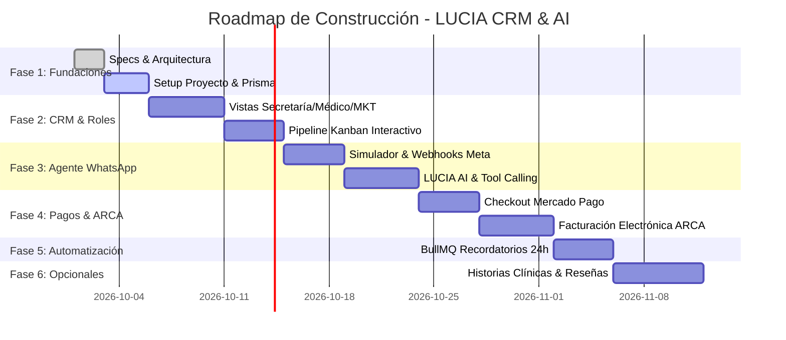

# LUCIA — Tu Recepcionista Oftalmológica Virtual con IA
## 05. Hoja de Ruta de Implementación (Roadmap & Milestones)

---

### Visión General del Enfoque Spec-Driven Design (SDD)

En la metodología **Spec-Driven Design**, el desarrollo sigue un proceso riguroso:
1. **Definición de Especificaciones** *(Completado: Specs 01 a 05)*.
2. **Revisión y Aprobación de Arquitectura y Contratos de Datos**.
3. **Desarrollo Guiado por Hitos (Milestones)** con pruebas de aceptación por cada fase.

---

### Desglose de Hitos de Implementación

#### Hito 1: Estructura Base, Modelos y Configuración Inicial
- Configuración del monorepo / proyecto Fullstack (Next.js 14+ App Router, TypeScript, Tailwind CSS, shadcn/ui).
- Inicialización de Prisma ORM con PostgreSQL.
- Scripts de migración y seed con datos oftalmológicos reales (Doctores, horarios de atención, obras sociales, consultorios).

#### Hito 2: CRM y Vistas de Rol (Secretaría, Médico, Marketing)
- **Vista Secretaría**: Tablero Kanban interactivo con drag-and-drop para mover pacientes entre fases del pipeline, inbox de chat de WhatsApp con botón de "Pausar / Reanudar LUCIA" para toma manual.
- **Vista Médico**: Agenda del día compacta, lista de pacientes asignados, motivo de consulta triagiado por la IA.
- **Vista Marketing**: Métricas de adquisición, atribución UTM (Meta Ads vs. Orgánico), tasa de conversión de agendamiento y facturación total.
- **Vista Admin**: Configuración de clínicas, médicos, aranceles y credenciales.

#### Hito 3: Agente Conversacional LUCIA & Conector WhatsApp
- Implementación de Webhook oficial para Meta WhatsApp Cloud API.
- **Simulador Interactivo de WhatsApp en el CRM**: Permite probar y validar en vivo los flujos de conversación de LUCIA (triage, preguntas frecuentes, selección de turnos) antes de conectar el número de WhatsApp de producción.
- Orquestador de Agente con LangChain / Vercel AI SDK y Tool Calling hacia el motor de turnos.

#### Hito 3.5: Identidad Visual del CRM (Logo y Paleta Clínica)
Objetivo: que el CRM se vea como un producto de salud profesional y confiable, con identidad propia de LUCIA, sin cambiar funcionalidad.

**Logo de LUCIA**
- Isotipo propio en SVG: un ojo estilizado cuyo iris sugiere una burbuja de chat (oftalmología + recepcionista por WhatsApp). Trazos simples, legible a 16 px.
- Variantes: logo completo (isotipo + "LUCIA"), isotipo solo (favicon, avatar de LUCIA en los chats) y monocromo blanco para fondos azules.
- Diseño original: no usa ni imita marcas de terceros (Meta/WhatsApp, Google, prepagas).
- Dónde va: pantalla de login, encabezado del menú lateral, favicon/ícono de la pestaña y avatar de los mensajes de LUCIA (Inbox y Simulador).

**Paleta clínica (azul, gris y blanco)** — definida como tokens de diseño (variables CSS de shadcn/ui en `globals.css`); ningún componente usa colores sueltos.

| Token | Color | Uso | Contraste vs. blanco |
| :--- | :--- | :--- | :--- |
| Primario | `#1D5FA6` (azul clínico) | Botones principales, enlaces, ítem activo del menú, barras del embudo | 6.48:1 |
| Primario hover | `#164C86` | Estado hover/presionado | 8.71:1 |
| Acento | `#3B82C4` (celeste) | **Sólo gráficos**: íconos, foco, detalles del logo (no texto) | 4.06:1 (≥ 3:1 para gráficos) |
| Azul tenue | `#E8F0FA` | Fondo del menú lateral, mensajes de LUCIA, columna activa del Kanban | — |
| Fondo suave | `#F3F6F9` (gris muy claro) | Fondo general de la app, columnas del Kanban | — |
| Superficie | `#FFFFFF` | Tarjetas, tablas, formularios, chat | — |
| Borde | `#D9E0E8` | Bordes y separadores | — |
| Texto | `#1F2A37` | Texto principal | 14.54:1 |
| Texto secundario | `#5B6675` | Etiquetas, ayudas, metadatos | 5.83:1 |
| Éxito | `#1E7A4C` | Confirmado, pago aprobado, "LUCIA activa" | 5.33:1 |
| Alerta | `#9A6200` | Reserva tentativa, pago pendiente | 5.10:1 |
| Peligro | `#B42318` | Urgencias, "Atención humana", cancelado, errores | 6.57:1 |

- Los estados (éxito, alerta, peligro) se usan sólo para estado, siempre con texto o ícono además del color.
- Tipografía: se mantiene Geist (sans) por legibilidad.
- Modo oscuro: fuera de alcance de este hito (el CRM se usa en recepción con modo claro).

**Alcance**
- Login con logo y fondo de marca; menú lateral con logo, azul tenue y estado activo en primario.
- Badges de estado de turnos, pagos, etapas del pipeline y urgencias según la tabla.
- Inbox y Simulador: mensajes de LUCIA en azul tenue con su avatar; mensajes de recepción en primario.
- Revisión visual de todas las pantallas (escritorio y celular) sin cambios de comportamiento.

**Criterios de aceptación**
1. El logo se ve en login, menú lateral, favicon y avatar de LUCIA, y es nítido de 16 px a 200 px.
2. Todo texto cumple WCAG AA (≥ 4.5:1) y los elementos gráficos ≥ 3:1.
3. No hay colores definidos fuera de los tokens (se verifica buscando hex sueltos en `src/`).
4. Las pruebas E2E y los casos de `qa/manual_tests.md` de los Hitos 1–3 siguen pasando sin cambios funcionales.

#### Hito 4: Pasarela de Cobros Mercado Pago
- Tabla de coberturas por obra social y plan (PRD §4.4.1, spec 03 §3): ABM en Configuración, herramienta `check_coverage` de LUCIA y monto del turno según la modalidad (sin cargo, copago, seña, particular).
- Generador de preferencias con expiración de 15 minutos (lock de slot).
- Endpoint receptor de Webhook de Mercado Pago con verificación de firma criptográfica.
- Actualización automática del estado del turno y notificación instantánea en el CRM.

#### Hito 5: Facturación Electrónica ARCA (ex-AFIP WSFEv1)
- Conexión con entorno de Homologación de ARCA (Testing) y posterior pase a Producción.
- Caching de Ticket de Acceso (WSAA) en Redis.
- Generación de Factura B / C con CAE, cálculo de importes y QR fiscal descargable.

#### Hito 6: Sistema de Recordatorios y Reactivación en Background (BullMQ + Redis)
- Cola `followup-24h`: Reactivación de pacientes que iniciaron consulta pero no finalizaron la reserva.
- Cola `reminder-24h`: Recordatorio automático con botones interactivos 24 horas antes del turno.

#### Hito 7 (Opcionales): Historia Clínica Oftalmológica, Recetas y Reseñas
- Ficha clínica oftalmológica (Agudeza Visual OD/OI, PIO, Biomicroscopía, Fondo de Ojo).
- Emisión de recetas en PDF.
- Disparo automático de solicitud de reseñas en Google Maps 3 horas después del turno completado.
