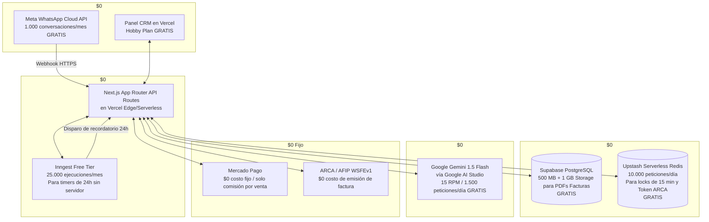

# LUCIA — Tu Recepcionista Oftalmológica Virtual con IA
## 06. Arquitectura de Infraestructura de Costo Cero ($0 USD / mes)

---

### 1. La Estrategia "Costo Cero" (Zero-Dollar Stack)

Para validar el MVP y operar las primeras clínicas sin incurrir en costos fijos mensuales de servidores o bases de datos, diseñamos una arquitectura basada **100% en los niveles gratuitos (Free Tiers permanentes)** de los mejores proveedores de la industria:



---

### 2. Desglose Componente por Componente ($0 USD)

| Componente | Proveedor Seleccionado | Nivel Gratuito (Free Tier) Incluido | Costo Fijo |
| :--- | :--- | :--- | :--- |
| **Frontend CRM + API Webhooks** | **Vercel** | Despliegue continuo desde GitHub, dominio SSL automático `.vercel.app`, soporte de rutas API serverless sin límite de proyectos. | **$0 / mes** |
| **Base de Datos Relacional (Postgres)** | **Supabase** | 500 MB de base de datos PostgreSQL, 50.000 usuarios activos al mes, 1 GB de almacenamiento para PDFs de facturas ARCA. | **$0 / mes** |
| **Caché y Locks (Redis Serverless)** | **Upstash Redis** | 10.000 comandos por día. Ideal para locks de 15 min anti-doble reserva y almacenar el Ticket de Acceso de ARCA (WSAA). | **$0 / mes** |
| **Motor de Recordatorios 24h (Durable Workflows)** | **Inngest** | **25.000 ejecuciones/mes gratis**. Resuelve el problema de no tener un servidor VPS corriendo 24/7. Permite hacer `await step.sleep('24h')` de forma nativa en código serverless. | **$0 / mes** |
| **Motor de Inteligencia Artificial (LLM)** | **Google Gemini 1.5 Flash** (Google AI Studio) | Nivel gratuito oficial de Google: hasta 15 solicitudes por minuto y 1.500 solicitudes por día con soporte de Function Calling / Tool Calling de ultra baja latencia. | **$0 / mes** |
| **WhatsApp Cloud API** | **Meta for Developers** | 1.000 conversaciones de servicio al mes gratis para cada cuenta de WhatsApp Business. | **$0 / mes** |
| **Cobros de Turnos** | **Mercado Pago** | Sin costos de apertura ni costos de mantenimiento fijos mensuales. Sólo retiene comisión porcentual cuando un paciente efectivamente paga. | **$0 / mes** |
| **Facturación Fiscal** | **ARCA (ex-AFIP)** | El acceso al Web Service WSFEv1 de ARCA es un servicio público gratuito del estado argentino. | **$0 / mes** |
| **Túnel para Desarrollo Local** | **Cloudflare Tunnels / ngrok** | Exposición de `localhost:3000` con HTTPS para recibir webhooks de Meta y Mercado Pago en desarrollo. | **$0 / mes** |
| **TOTAL MENSUAL FIJO** | — | — | **$0.00 USD** |

---

### 3. ¿Cómo resolvemos los Recordatorios de 24h sin un Servidor Dedicado?

En arquitecturas tradicionales se paga un servidor VPS o Redis con BullMQ que debe estar encendido las 24 horas del día.  
Con la arquitectura **Inngest + Vercel**, el código se ejecuta como un **flujo durable serverless** con costo cero:

```typescript
// Ejemplo del Workflow de Turno en Inngest (Costo $0)
import { inngest } from "@/lib/inngest";

export const handleAppointmentLifecycle = inngest.createFunction(
  { id: "appointment-lifecycle" },
  { event: "appointment/booked" },
  async ({ event, step }) => {
    // 1. Espera hasta exactamente 24 horas antes del turno (sin consumir servidor)
    const reminderDate = new Date(event.data.appointmentDate);
    reminderDate.setHours(reminderDate.getHours() - 24);
    
    await step.sleepUntil("wait-for-reminder-window", reminderDate);

    // 2. Se despierta automáticamente y envía el WhatsApp de recordatorio
    await step.run("send-whatsapp-reminder", async () => {
      await sendWhatsAppTemplate({
        to: event.data.patientPhone,
        templateName: "recordatorio_turno_24h",
        variables: [event.data.patientName, event.data.doctorName, event.data.time]
      });
    });
  }
);
```

---

### 4. ¿Cómo resolvemos el Lock de 15 minutos de Mercado Pago sin costo?

Utilizamos **Upstash Redis Serverless** con expiración de clave:
1. Cuando el paciente selecciona un turno, se guarda una clave en Redis con TTL de 15 minutos:
   `SET slot:doctor_1:2026-10-01-10:00 "locked" EX 900 NX`
2. Si el webhook de Mercado Pago confirma el pago antes de los 900 segundos, el turno se asienta en PostgreSQL como `CONFIRMED`.
3. Si el paciente no paga, Redis elimina la clave automáticamente a los 15 minutos, liberando el slot para otros pacientes sin intervención manual ni costos de procesamiento.

---

### 5. Umbral de Crecimiento: ¿Cuándo habría que pagar?

Este stack soporta cómodamente entre **1 y 5 consultorios oftalmológicos activos**:
* **Supabase**: 500 MB alcanzan para más de 150.000 turnos y pacientes antes de requerir un upgrade a $25 USD.
* **Inngest**: 25.000 ejecuciones cubren más de 800 turnos mensuales con todos sus recordatorios y reactivaciones.
* **Gemini 1.5 Flash**: 1.500 turnos/conversaciones diarias de forma gratuita.

Esto significa que **no pagarás un solo dólar hasta que el producto ya esté facturando y validado con pacientes reales**.
